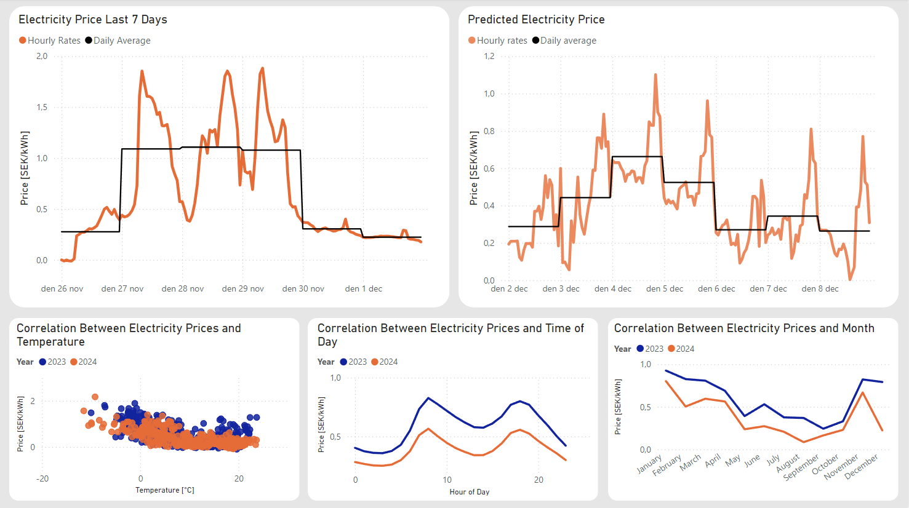

# ETL Project: Electricity Prices
Are you annoyed that those pesky electricity providers squeezing your wallet dry? Did you know that you can predict electricity prices? Do you want to spend less money on electricity and more on blackjack and hookers? You're in luck, this witchcraft of a project will give you the insight you need to undertsand when it's time to game or mine crypto, and when it's time to go outside and touch some grass.

## Introduction
This project aims to build a data pipeline using **Databricks** to analyze electricity prices in relation to external factors like weather conditions.  
By processing the data to detect patterns the pipeline will generate insight and forecast future electricity prices.  

## Tools and requirements
1. **APIs:** Fetch data from these sources:
[Weather](https://open-meteo.com/en/docs/historical-forecast-api#latitude=59.3294&longitude=18.0687&start_date=2024-10-28&hourly=temperature_2m,relative_humidity_2m,precipitation,cloud_cover,wind_speed_80m,uv_index,is_day,sunshine_duration&wind_speed_unit=ms), [Electricity Prices](https://www.elprisetjustnu.se/elpris-api)
2. **Databricks Notebook, Workflow:**
Used to fetch and transform historical and daily data from APIs. Automate API fetches and alerts when failed.
3. **Azure Data Lake:**
Stores data in [medallion structure](https://learn.microsoft.com/en-us/azure/architecture/solution-ideas/articles/azure-databricks-modern-analytics-architecture), making it scalable and accessable for transformation and analysis.
4. **MLFlow and Spark MLlib:**
Analyze data, detect patterns and build predictive model that forecast electricity prices.
5. **PowerBI, Azure Monitor:**
Visualizes current and forecasted data while Azure Monitor sends alerts based on defined thresholds.

## Steps for setting up project
### 1. Initial setup
* Create a Storage account and make sure its a StorageV2 account and that Hierarchical namespace is enabled.   

* Create a Databricks Workspace in Azure and import each notebook.   
* Insert variables in ***mount.py*** to mount your container. Run it.
### 2. Building pipeline
* Run ***Bulk Electricity Prices.py*** and ***Bulk WeatherData.py*** first to fetch historical data. When they're done run ***Bulk Gold.py*** to clean and aggregate said data.
* Run ***Predictive Model.py***. Tweak configuration and features if neccesary.
* Create a workflow where daily data is being fetched.

### 3. Visualize data
* Create PowerBI dashboard and [connect](learn.microsoft.com/en-us/fabric/onelake/create-adls-shortcut) your data.

* Visualize your data using your favourite graphs.

